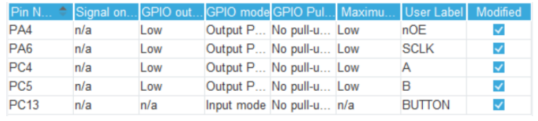

# **Лаборатораня работа №1**
## Знакомство с SPI. Применение библиотек при разработке ПО под STM32
***
## Задание
Реализовать игру жанра *"Google_Dino"* на основе отладочной платы NUCLEO на базе микроконтроллера серии STMicroelectronics, с выводом изображения на 
светодиодную матрицу LEDP10.

*Дополнительное задание*: сделать разную высоту прыжка в зависимости от времени зажатия.
***
## Краткое описание
В ходе данной работы необходимо написать программу для игры *"Google_Dino"* с визуализацией этой игры на LED-панель P10. Взаимодействие происходит по протоколу SPI, который отправляет и загружает данные в панель размерностью 16х32.

Код для программы был написал на языке **С**. Для реализации прыжка была использована кнопка на отладочной плате. Для работы с led-панелью были установлены дополнительные библиотеки [disp1color.c](Project_LB1/Core/Src/disp1color.c). Для корректного вывода текста на led-панель были использованы библиотеки [f10x16f.c](Project_LB1/Core/Src/f10x16f.c), [f6x8m.c](Project_LB1/Core/Src/f6x8m.c) и [font.c](Project_LB1/Core/Src/font.c)

Листинги программного кода можно посмотреть в директории `Project_LB1/Core/Src` в файлах [main.c](Lab_1/Lab_5_fix/Core/Src/main.c) и
[stm32f4xx_it.c](Lab_1/Lab_5_fix/Core/Src/stm32f4xx_it.c).

Отчёт к данной работе: <https://docs.google.com/document/d/1bmmBl_UGj2rrcNi57MLyHoi01FUQnBxSzopLlw7OWnQ/edit>

Видео-отчёт: [Google_Dino.mp4](Google_Dino.mp4)

### Протокол SPI. Основные моменты
#### Интерфейс
**SPI** (англ. *Serial Peripheral Interface*, *SPI bus* — последовательный периферийный интерфейс, шина *SPI*) — последовательный синхронный стандарт передачи данных в режиме полного дуплекса, предназначенный для обеспечения простого и недорогого высокоскоростного сопряжения микроконтроллеров и периферии. *SPI* также иногда называют четырёхпроводным (англ. *four-wire*) интерфейсом.

В SPI используются четыре цифровых сигнала:

***MOSI*** — выход ведущего, вход ведомого (англ. *Master Out Slave In*). Служит для передачи данных от ведущего устройства ведомому.
***MISO*** — вход ведущего, выход ведомого (англ. *Master In Slave Out*). Служит для передачи данных от ведомого устройства ведущему.
***SCLK*** или ***SCK*** — последовательный тактовый сигнал (англ. *Serial Clock*). Служит для передачи тактового сигнала для ведомых устройств.
**CS*** или ***SS*** — выбор микросхемы, выбор ведомого (англ. *Chip Select*, *Slave Select*).

Конкретные имена портов интерфейса *SPI* могут различаться в зависимости от производителя аппаратных средств, при этом возможны следующие варианты:

| Порт | Master                                | Slave         |
|------|---------------------------------------|---------------|
| MISO | SOMI, SDI, RX                         | SOMI, SDO, TX |
| MOSI | SIMO, SDO, TX                         | SIMO, SDI, RX |
| SCLK | SCK, CLK, SPC (SPI serial port clock) | <---          | 
| SS   | nCS, CS, CSB, CSN, NSS, nSS, STE, SYN | <---          |

#### Синхронизация в SPI
Частота следования битовых интервалов в линиях передачи данных определяется синхросигналом *SCK*, который генерирует ведущее устройство, ведомые устройства используют синхросигнал для определения моментов изменения битов на линии данных, при этом ведомые устройства никак не могут влиять на частоту следования битовых интервалов. Как в ведущем устройстве, так и в ведомом устройстве имеется счетчик импульсов синхронизации (битов). Счетчик в ведомом устройстве позволяет последнему определить момент окончания передачи пакета. Счетчик сбрасывается при выключении подсистемы *SPI*, такая возможность всегда имеется в ведущем устройстве. В ведомом устройстве счетчик обычно сбрасывается деактивацией интерфейсного сигнала *SS*.

Так как действия ведущего и ведомого устройства тактируются одним и тем же сигналом, то к стабильности этого сигнала не предъявляется никаких требований, за исключением ограничения на длительность полупериодов, которая определяется максимальной рабочей частотой более медленного устройства. Это позволяет использовать *SPI* в системах с низкостабильной тактовой частотой, а также облегчает программную эмуляцию ведущего устройства.

#### Прием и передача данных в SPI

Передача осуществляется пакетами. Длина пакета, как правило, составляет 1 байт (8 бит), при этом известны реализации *SPI* с иной длиной пакета, например, 4 бита. Ведущее устройство инициирует цикл связи установкой низкого уровня на выводе выбора подчиненного устройства (*SS*) того устройства, с которым необходимо установить соединение.

При низком уровне сигнала *SS*:

* схемотехника ведомого устройства находится в активном состоянии;
* вывод ***MISO*** переводится в режим «выход»;
* тактовый сигнал ***SCLK*** от ведущего устройства воспринимается ведомым и вызывает считывание на входе *MOSI* значений передаваемых от ведущего битов и сдвиг регистра ведомого устройства.

Подлежащие передаче данные ведущее и ведомое устройства помещают в сдвиговые регистры. После этого ведущее устройство начинает генерировать импульсы синхронизации на линии ***SCLK***, что приводит к взаимному обмену данными. Передача данных осуществляется бит за битом от ведущего по линии ***MOSI*** и от ведомого по линии ***MISO***. Передача осуществляется, как правило, начиная со старших битов, но некоторые производители допускают изменение порядка передачи битов программными методами. После передачи каждого пакета данных ведущее устройство, в целях синхронизации ведомого устройства, может перевести линию ***SS*** в высокое состояние.

#### Преимущества и недостатки интерфейса SPI
**Преимущества**:
* Полнодуплексная передача данных по умолчанию.

* Более высокая пропускная способность по сравнению с I²C или SMBus.

* Возможность произвольного выбора длины пакета, длина пакета не ограничена восемью битами.

* Простота аппаратной реализации:

  * более низкие требования к энергопотреблению по сравнению с I²C и SMBus;

  * возможно использование в системах с низкостабильной тактовой частотой;

  * ведомым устройствам не нужен уникальный адрес, в отличие от таких интерфейсов, как I²C, GPIB или SCSI.

* Используется только четыре вывода, что гораздо меньше, чем для параллельных интерфейсов.

* Однонаправленный характер сигналов позволяет при необходимости легко организовать гальваническую развязку между ведущим и ведомыми устройствами.

* Максимальная тактовая частота ограничена только быстродействием устройств, участвующих в обмене данными.

**Недостатки**:
* Необходимо больше выводов, чем для интерфейса I²C.

* Ведомое устройство не может управлять потоком данных.

* Нет подтверждения приема данных со стороны ведомого устройства (ведущее устройство может передавать данные «в никуда»).

* Нет определенного стандартом протокола обнаружения ошибок.

* Отсутствие официального стандарта, что делает невозможным сертификацию устройств.

* По дальности передачи данных интерфейс SPI уступает таким стандартам, как UART и CAN.

* Наличие множества вариантов реализации интерфейса.

* Отсутствие поддержки горячего подключения устройств.

## LED-панель P10. Основные моменты

**LED-панель P10** или **P10 Led Board** - панель, состоящая из корпуса, светодиодов и управляющих микросхем. Размерность данной модели составляет 16 пикселей на 32 пикселя. Работа с данной панелью осуществляется по протоколу *SPI* с использованием *SCK* и *MOSI*.

Основные параметры данной панели:

* Размер: 32 (длина) на 16 (высота) в светодиодах

* Питающее напряжение: 5 вольт постоянного тока

* Максимальное потребление тока: 5 ампер

* Максимальная мощность: 25 Ватт

Ниже представлено изображение коннекторов на LED-панели и их распиновка. Включать их следует строго в таком порядке. Если при подключении плата никак не реагирует, попробуйте перевернуть разъем.

На разъёме:

* ***C***, ***G***, ***D*** — не используются (возможно они используются в 3-цветных матрицах).

* ***A*** и ***B*** — задают, какая из 4 групп светодиодов экрана работает в данный момент. Матрицы используют динамическую индикацию, поочерёдно переключая 4 группы светодиодов в зависимости от логических уровней на ножках *A* и *B*. На плате эти сигналы приходят на дешифратор D18, который открывает 1 из 4 групп P-канальных полевиков, тем самым подавая +5В на аноды светодиодов выбранной группы.

* ***nOE*** — разрешает работу матрицы (лог. 0 гасит все матрицы в цепочке).

* ***MOSI*** — канал передачи данных.

* ***SCLK*** — канал подтверждения конца загрузки байта данных.

* ***SCK*** — канал для синхронизации частот работы периферии.

Ниже приведена принципиальная схема LED-панели P10

Логика обновления экрана (точнее четверти экрана) выглядит следующим образом:

1. Выдаём по *SPI* данные для сдвиговых регистров. Для одной матрицы 32x16 это 16 байт (16 8-битных регистров).

2. Устанавливаем лог. 0 на ножке *nOE*.

3. Устанавливаем лог. уровни на ножках *A* и *B* в соответствии с обновляемой группой светодиодов (одной из четырёх). Это подаёт +5В на аноды светодиодов выбранной группы.

4. Выдаём на ножку *SCLK* короткий положительный импульс. Это подаёт землю на катоды светодиодов в соответствии с загруженными в регистры байтами.

5. Устанавливаем лог. 1 на ножке nOE. При этом четверть экрана (одна группа светодиодов) загорается и горит до следующего обновления следующей группы светодиодов.

6. Повторяем пункты **1-5** с постоянным периодом.

## Основной ход работы
### Подключение и настройка NUCLEO-F446RET6 

Распиновка микроконтроллера выглядит следующим образом

Перечень используемых пинов:

* PC4 - A - отвечает за выбор строки для загрузки данных;

* PC5 - B - отвечает за выбор строки для загрузки данных;

* PA4 - nOE - отвечает за включение / выключение панели;

* PA6 - SCLK - канал для прменения полученных данных (необходимо подать высокий и следом сразу низкий сигнал);

* PA5 - SPI1_SCK - канал для тактирования ведомого устройства от ведущего;

* PA7 - SPI1_MOSI -канал для передачи данных;

* PH0 - RCC_OSC_IN - канал для подключения внешнего тактового резонатора высокой частоты;

* PH1 - RCC_OSC_OUT - канал для подключения внешнего тактового резонатора высокой частоты.

Ниже изображены настройки SPI1 внутри STM32CobeIDE.

Ниже изображены настройки TIM1 внутри STM32CobeIDE.

Ниже изображены настройки TIM2 внутри STM32CobeIDE.

Ниже изображены настройки TIM3 внутри STM32CobeIDE.

Ниже изображены настройки TIM4 внутри STM32CobeIDE.

Ниже изображены настройки TIM9 внутри STM32CobeIDE.

Ниже изображены настройки TIM10 внутри STM32CobeIDE.

Ниже изображены настройки TIM12 внутри STM32CobeIDE.

